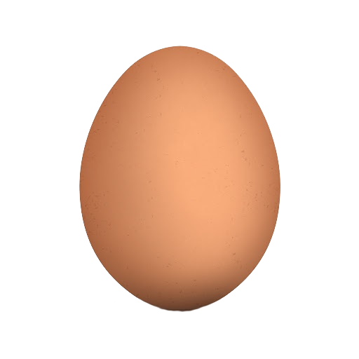
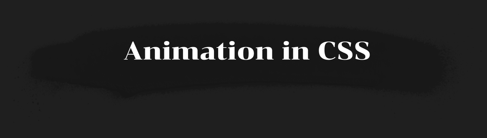

# Animation in CSS

  Проект "Animation in CSS" - это набор инструкций и примеров, которые помогут пользователям создавать динамические и интерактивные веб-страницы с помощью CSS-анимации. Цель проекта - предоставить пользователям простой и доступный способ создавать анимации без необходимости использования сложных программ или инструментов.
  
  

  В разделе "Требования" будут перечислены все знания и инструменты, необходимые для использования проекта "Animation in CSS".
  1. Знание HTML и CSS
  2. Текстовый редактор или IDE для написания кода
  3. Браузер для просмотра результатов
  4. Опционально: знание JavaScript для создания более сложных анимаций

Установка проекта "Animation in CSS" не требует специальных шагов, так как он использует только стандартные технологии HTML и CSS.
1) Скачайте или скопируйте код проекта из репозитория на GitHub.
2) Откройте текстовый редактор или IDE и сохраните файлы проекта.
3) Откройте файлы проекта в браузере для просмотра результатов

После установки проекта "Animation in CSS", пользователь может использовать его для создания динамических и интерактивных веб-страниц с помощью CSS-анимации.

Откройте файлы проекта в текстовом редакторе или IDE.

Изучите примеры анимации, которые включены в проект, и используйте их в качестве основы для создания собственных анимаций.

Изучите инструкции и опции, которые описаны в файле "README.md" проекта, чтобы узнать, как использовать различные свойства и функции CSS для создания анимации.

Изучите примеры кода, которые включены в проект, чтобы узнать, как создавать анимации с помощью различных методов и свойств CSS.

Используйте свойства и функции CSS, которые описаны в файле "README.md" проекта, чтобы создавать свои собственные анимации.